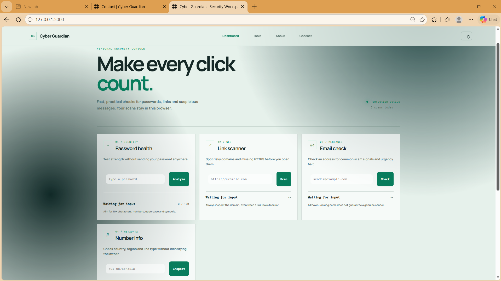

# 🛡️ Cyber Guardian

**Cyber Guardian** is a web-based security awareness toolkit designed to provide quick, understandable checks for common online-safety risks.

It provides first-pass checks for **password strength, suspicious links, email addresses, and phone-number metadata**, along with a simple security assistant for common questions about passwords, phishing, links, and OTPs.

> ⚠️ **Educational Project:** Cyber Guardian provides awareness indicators, not guaranteed security verdicts. It should not replace professional security tools or security advice.

---

## 🌐 Live Demo

🔗 **Live Website:**
`YOUR_LIVE_URL_HERE`

---

## ✨ Features

### 🔐 Password Health

Analyze a password based on:

* Length
* Uppercase characters
* Numbers
* Symbols
* Overall strength score

The password checker uses a 10+ character target along with uppercase characters, numbers, and symbols.

---

### 🔗 Link Scanner

Check URLs for basic warning signs such as:

* Missing HTTPS
* Suspicious words in the URL
* Invalid URL format

The tool provides a first-pass result and reminds users to verify the domain before entering sensitive information.

---

### 📧 Email Check

The email checker validates the basic email format and checks for common suspicious terms such as:

* `lottery`
* `winner`
* `urgent`
* `free`
* `prize`

It also provides a safety reminder to check the sender domain and unexpected attachments.

---

### 📱 Phone Number Information

The phone checker can provide basic metadata including:

* Country
* Region
* Number type
* Validity/possible-number status

It is designed as metadata inspection and does **not identify the owner** of the number.

---

### 🤖 Security Assistant

The built-in security assistant provides simple guidance for questions involving:

* Passwords
* Phishing
* Suspicious links
* OTPs
* Email safety

It is designed for quick security-awareness guidance.

---

### 📊 Local Activity

Recent security checks can appear in the dashboard as local activity.

The project is designed so that scan history remains in the browser rather than building a server-side activity profile.

---

## 🔒 Privacy-Focused Design

Cyber Guardian follows a browser-focused approach:

* Scan history is stored in browser local storage.
* Password values are not added to the history.
* The server does not keep scan records.

The project also explicitly advises users not to enter sensitive information such as passwords, OTPs, or payment details into the contact form.

---

## 🖥️ Pages

The application includes:

| Page         | Purpose                                     |
| ------------ | ------------------------------------------- |
| 🏠 Dashboard | Main security workspace                     |
| 🛠️ Tools    | Overview of available security checks       |
| ℹ️ About     | Project purpose and design principles       |
| 📩 Contact   | Feedback and bug-report form                |
| 📜 Terms     | Usage boundaries and educational disclaimer |

The navigation connects these sections throughout the application.

---

## 🛠️ Tech Stack

### Frontend

* HTML5
* CSS3
* JavaScript

### Backend

* Python
* Flask
* `phonenumbers`

The backend exposes Flask routes for the password, URL, email, phone, and security-assistant checks.

### Dependencies

```text
Flask
phonenumbers
gunicorn
```

---

## 🏗️ Application Flow

```text
                ┌─────────────────────┐
                │       User          │
                └──────────┬──────────┘
                           │
                           ▼
                ┌─────────────────────┐
                │ Cyber Guardian UI   │
                │ HTML / CSS / JS     │
                └──────────┬──────────┘
                           │
                           ▼
                ┌─────────────────────┐
                │    Flask Backend    │
                └──────────┬──────────┘
                           │
          ┌────────────────┼────────────────┐
          ▼                ▼                ▼
     Password          URL/Email        Phone Info
       Check             Check            Check
          │                │                │
          └────────────────┼────────────────┘
                           ▼
                ┌─────────────────────┐
                │ Security Result     │
                └─────────────────────┘
```

---

## 📂 Project Structure

A typical project structure is:

```text
Cyber-Guardian/
│
├── app.py
├── requirements.txt
├── .gitignore
│
├── templates/
│   ├── index.html
│   ├── tools.html
│   ├── about.html
│   ├── contact.html
│   └── terms.html
│
├── static/
│   ├── style.css
│   └── script.js
│
└── README.md
```

---

## 🚀 Run Locally

### 1. Clone the repository

```bash
git clone YOUR_GITHUB_REPOSITORY_URL
cd Cyber-Guardian
```

### 2. Create a virtual environment

```bash
python -m venv venv
```

### 3. Activate it

**Windows:**

```bash
venv\Scripts\activate
```

**Linux/macOS:**

```bash
source venv/bin/activate
```

### 4. Install dependencies

```bash
pip install -r requirements.txt
```

The project dependencies include Flask, `phonenumbers`, and Gunicorn.

### 5. Run the application

```bash
python app.py
```

The Flask application serves the main dashboard and the other application pages through its routes.

---

## 🔌 Backend Routes

| Method | Route             | Purpose            |
| ------ | ----------------- | ------------------ |
| GET    | `/`               | Dashboard          |
| GET    | `/tools`          | Tools page         |
| GET    | `/about`          | About page         |
| GET    | `/contact`        | Contact page       |
| GET    | `/terms`          | Terms page         |
| POST   | `/check_password` | Password analysis  |
| POST   | `/check_url`      | URL analysis       |
| POST   | `/check_email`    | Email analysis     |
| POST   | `/check_phone`    | Phone metadata     |
| POST   | `/chat`           | Security assistant |

These routes are implemented in the Flask backend.

---

## 📸 Screenshots

Add your project screenshots here:

```md
### 🏠 Dashboard



### 🔐 Password Check


### 🔗 Link Scanner


### 📧 Email Check


### 📱 Phone Information


```

Recommended folder:

```text
screenshots/
├── dashboard.png
├── tools.png
├── contact.png
├── about.png
└── terms.png
```

---

## 🎯 Project Goals

Cyber Guardian focuses on making basic online-security awareness more approachable.

The project encourages users to:

* Pause before trusting suspicious content
* Inspect links and domains
* Use stronger passwords
* Be careful with unexpected emails
* Never share OTPs or sensitive information
* Verify information before taking action

The project's About page describes its central idea as **awareness before action**.

---

## ⚠️ Limitations

Cyber Guardian is a **first-pass awareness tool**.

Its results should not be treated as definitive security guarantees. For example:

* A URL marked safe does not guarantee that the website is trustworthy.
* A password score does not represent complete password-security analysis.
* Email checks do not prove the identity of a sender.
* Phone metadata does not identify the owner.
* Security-assistant responses are basic awareness guidance.

The project's Terms page explicitly states that its checks are indicators and should not replace professional security tools or advice.

---

## 🔮 Future Improvements

Possible improvements include:

* More advanced phishing detection
* Domain reputation checks
* Improved email analysis
* More comprehensive password analysis
* Additional security-awareness tools
* More advanced chatbot capabilities
* Expanded reporting and visualization
* Additional privacy controls

---

## 👨‍💻 Author

**Suman Kumar**

B.Tech CSE — AI & Data Science
Web Development | AI/ML | Data Science | Cybersecurity

### Connect

* 💻 GitHub: `https://github.com/suman9834`
* 💼 LinkedIn: `https://www.linkedin.com/in/suman-kumar-93b1b4314/`

---

## ⭐ Support

If you find **Cyber Guardian** useful or interesting, consider giving the repository a ⭐ on GitHub.

---

## 📜 Disclaimer

Cyber Guardian is an **educational cybersecurity-awareness project**.

It does not guarantee that a password, URL, email address, or phone number is safe or unsafe. Users should independently verify important security decisions and should never submit confidential information to an untrusted service.
